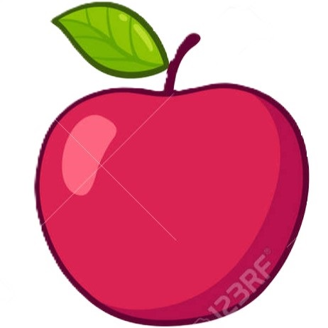
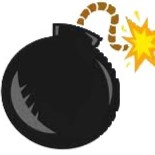

# Republic Snake.

Le joueur contrôle un serpent, qui peut slalomer d'un bord de l'écran à l'autre et les obstacles qui parsèment le niveau. 
Pour gagner chacun des niveaux, le joueur doit faire manger à son serpent un certain nombre de pomme, allongeant à chaque 
fois la taille du serpent. Mais des cadeaux empoisonnés sont dispersés de temps en temps dans le niveau, divisant par 2 
la taille du reptile. Alors que le serpent avance inexorablement, le joueur ne peut que lui indiquer une direction à suivre
(en haut, en bas, à gauche, à droite) afin d'éviter que la tête du serpent ne touche les bombes ou son propre corps, 
auquel cas, il risque de mourir.

## Lancement du Jeu : 

Lancer IntelliJ IDEA (Compilateur) 

Cliquer dans le dossier src sur "REPUBLIC_SNAKE"

Cliquer faire le run (compiler "object test" extends App")

La partie se lance directement

_____________________________________________________________________________________________________________________________________________________________________________

## Commandes du jeu :

Utiliser les flêches directionnelles du clavier pour jouer 
Le serpent se dirige : 
- vers le haut, si la flêche HAUT a été appuyée ;
- vers le bas, si la flêche BAS a été appuyée ;
- vers la droite, si la flêche DROITE a été appuyée ;
- vers la gauche, si la flêche GAUCHE a été appuyée ;

Après avoir appuyé sur une touche directionnelle, le serpent avance automatiquement dans cette même direction.

⚠️ 1: Le déplacement du serpent ne dépend pas de la direction de sa tête, vous devez vous baser sur la fenêtre de jeu.
(DROTE: droite de la fenêtre, GAUCHE: gauche de la fenêtre, etc.)

Exemple : si le serpent va vers le bas, appuyer sur la flêche DROITE fera que le serpent tournera sur sa gauche ;
          si le serpent va vers la gauche, appuyer sur la flêche HAUT fera que le serpent tournera sur sa droite.

⚠️ 2 : Le serpent ne peut pas revenir sur ses pas.
Exemple : si le serpent va vers la droite, appuyer sur la flêche GAUCHE n'aura aucune action (désactivée) ;
          si le serpent va vers le bas, appuyer sur la flêche HAUT n'aura aucune action (désactivée).

### Autres touches:

Touche 's' : "stop/start" : Permet de mettre le jeu en pause (on est dans le "menu pause") et si on appuie de nouveau 
sur la touche permet de sortir de la pause.

En pleine partie ou depuis le "Menu Pause"

Touche 'e' : "Exit" : Permet d'aller au "Menu Principal" (Pour relancer une nouvelle partie).

Depuis le "Menu Principale"

Touche 'e' : Arrête le Jeu (disparition du Menu) et invitation à fermer la fenêtre de Jeu.

Touche 'p' : Permet de relancer une nouvelle partie.

## Règle du jeu :
Voici quelques règles de jeu

### Objectif : 
-  Manger les Pommes (contribue au Score de la partie) ;
-  Eviter les Bombes (si une est mangée, alors la partie est perdue) ;
-  Manger les cadeaux, pour réduire la taille du serpent par 2 (mais la taille ne peut le réduire plus bas que 3) ;
- Eviter que le serpent se mange lui-même.
  
  
 

### Apparition des objets :
- Ils apparaissent à des positions aléatoires sur la grille ;
-  Les Pommes sont toujours au nombre de 3, tout au long de la partie.
  Le fait d'en manger une, entraîne une nouvelle sur la grille ;
-  Les Bombes apparaîssent une par une, à partir de 100 périodes (appelé "temps" dans le jeu), pour rester définitivement.
  Une bombe est ajoutée lorsque le nombre de périodes équivaut à un multiple de 40 (ex: 120, 160, 200, etc.) ;
-  Un Cadeau apparaît à partir de 200 périodes, de manière aléatoire dans le temps.
  Celui-ci reste uniquement pour moins de 30 périodes de jeu.
  Il ne peut pas avoir qu'au plus qu'un cadeau sur la grille à la fois ;

### Fin de partie :
 Le jeu est perdu si le serpent se mange lui-même ou mange une Bombe.

 -----------------------------------------------------------------------------------------------------------------------
## Structure du code

Le code du jeu se sépare en 2 parties. Une partie 'main' où le fonctionnement en lui-même du jeu se trouve et une partie secondaire gérant la musique du jeu.
Le try s'assure que la lecture du fichier audio se fait sans problème. ⚠️ AudioSystem ne gère que les fichiers sonores en *.wav, il faut faire attention de convertir tous les fichiers audios avant.

### Main: Class Snake
La class Snake comporte toutes les fonctions nécessaires au fonctionnement du jeu. Il commence avec les déclarations de tous les variables nécessaires pour les fonctions et les options du jeu.
Nous avons ensuite les fonctions créant le serpent, ses proies et les pièges. Tout comme les fonctions gérant le déplacement et le comportement en jeu des différents éléments sur la grille.
La fonction 'affichageDuJeu' gère toute la partie graphique et visuel du jeu.

#### **Variable**
Nous avons un premier bloc de variables qui définissent les valeurs internes de base pour le jeu. Les valeurs peuvent être séparées en 2 groupes : positif et négatif.
Les valeurs positives concernent tout ce qui touche au serpent. Les valeurs négatives concernent tous les objets en plus apparaissant sur la grille de jeu. (proies, bombes, cadeaux)

Le deuxième bloc de variable concerne la gestion des objets en eux-mêmes. Que ce soit le nombre de proies en jeu, ceux ayant été mangés et le nombre de réducteurs actuellement en jeu.

Le troisième bloc initialise les variables gérant la musique. 'background_music' permet de lancer une musique de fond et 'snake_sound' fait entendre un bruit de couleuvre quand il est apprelé.

Le dernier bloc sert à gérer la position de la tête du serpent sur la grille.

####
La ligne suivant ce bloc définit la position de la tête sur la grille au lancement du jeu (position aléatoire).

#### **def creerSerpent**
Fonction qui génère la queue et le reste du corps du serpent. La longueur de base est de '3', définit dans 'longueurInitSerpent'.

#### **def creerProies**
La fonction creerProies demande un argument lui disant le nombre de proies à ajouter au jeu. Une variable countProieInit compte le nombre de proies ayant été initialisé dans le jeu.
Si sa valeur est supérieur à celle du nombre de proies lui ayant été donné, plus aucune proie ne sera ajoutée. Leurs coordonnées sont complètement aléatoires.

#### **def creerObstacles + def creerReducteur**
Ses deux fonctions possèdent la même logique que 'creerProies'. La seule différence se trouve dans creerReducteur où le nombre de réducteur est limité à 1 en jeu. 

#### **def suppression**
La fonction permet de 'supprimer' les éléments visible sur la grille.
Elle possède 1 argument, le quoi qui nous permet de spécifier quelles valeurs nous voulons enlever (par rapports au valeurs définies au début de la class)

#### **def bouger**
La fonction bouger gère le déplacement du serpent, plus précisément l'orientation de la tête du serpent dans les 4 points cardinaux.
Une gestion hors grille est aussi faite via la fonction 'horsGrille'.
La fonction 'suivreTête' est appelé dedans, tout comme la fonction 'mangerParTete' dans le dir match avec la fonction 'horsGrille'

#### **def mangerParTete**
La fonction mangerParTete possède 2 arguments qui servent à gérer la position de la tête du serpent dans la grille. Elle est appelé dans def bouger.
4 boucles if /else if est utilisé pour conditionner son fonctionnement via la variable 'quoiMange' (valeur de la case où se trouve la tête) :
1. S'il possède la même valeur que les proies, le serpent grandi de 1. La fonction 'creerProies' est appelée à se moment-là 
1. S'il est plus grande que 1 ou possède la même valeur que obstacleMortel, c'est un game over. (Le serpent se serait alors pris une bombe ou s'est mangé)
1. S'il est de même valeur que reducteurDeSerpent, la taille du serpent est divisé par 2, avec une limite minimum de 3, la taille ne peut pas allée plus bas
2. Sinon, la case ne cange pas

#### **def suivreTête**
La fonction permet au reste du corps de suivre fluidement les mouvements de la tête. Si la valeur de valCase est supérieur à 1 et inférieur à la taille du serpent, la case prend la valeur de la variable + 1.
Si la valeur est la même que la taille maximum, la case prend la valeur de défaut (0).

#### **def horsGrille**
La fonction gère les zones grilles. Elle permet au serpent d'apparaître de l'autre côté de la fenêtre de jeu lorsqu'il sort.

#### **def affichageDuJeu**
La fonction affichageDuJeu est la fonction utilisant FunGraphics pour afficher le jeu. L'apparence du serpent, des proies, des bombes et des cadeaux se font ici.
Le menu et la fenêtre de pause est également géré ici.
Le jeu est lancé lorsque la fonction est appelée, les dimensions du plateau de jeu sont déjà définies. Une variable permettant de mémorisation la dernière touche activée se trouve là.

Des fonctions permettant d'implémenter des images pour le corps, la tête, les bombes et cadeaux se trouvent ici.
L'affichage des différentes variables nécessaires et informations de jeu sur la partie droite de la fenêtre de jeu se fait dans la fonction 'affichageScore'

La fonction serpentDecoratif fait apparaître un serpent dans le menu du jeu.
C'est dans la fonction dessiner que se trouve les conditions d'appels des fonctions gérant les images pour les différents éléments du jeu.

La boucle while ont fin de la fonction résume toutes les étapes d'appels des fonctions définies précédemment.

#### **def chercheValeurDansLeTableau**
La fonction permet de retrouver une valeur précise dans la grille de jeu.

### Secondaire: Class SnakeSoundPlayer
La class SnakeSoundPlayer est une classe AudioSystem et Clip ayant pour rôle de générer et contrôler la musique/bruitage du jeu.
Nous avons une fonction play qui joue le background musical du jeu dès le lancement du programme à sa fin.

La fonction play possède un argument de type float qui sert à gérer le niveau sonore de la musique. Le volume de base du fichier audio est divisé par la valeur float donné en argument.
(Dans ce cas, le volume de base du fichier est de -1, ce qui nous donne des fractions négatives, diminuant bien le volume. Si le volume de base est positif, il faudrait donnée des valeurs négatives dans l'argument.)
Un audioClip.loop(-1) permet de faire jouer en boucle la musique.

Nous avons aussi une fonction playSnakeSound qui gère un bruit de couleuvre s'activant uniquement lorsque le serpent change de direction.
La fonction playSnakeSound à la même configuration que play et le même fonctionnement.

## Galerie

 _____________________________________________________________________________________________________________________________________________________________________________

 ## Crédit :

  Maroua & Florian

  Sion, 2024
